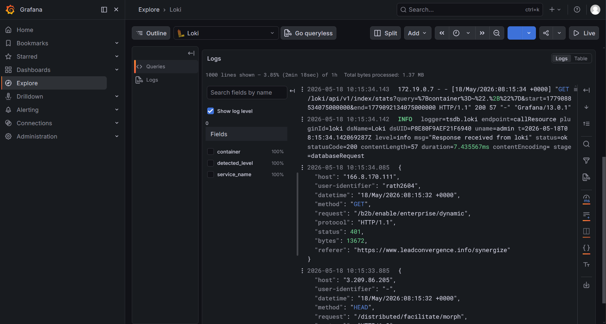
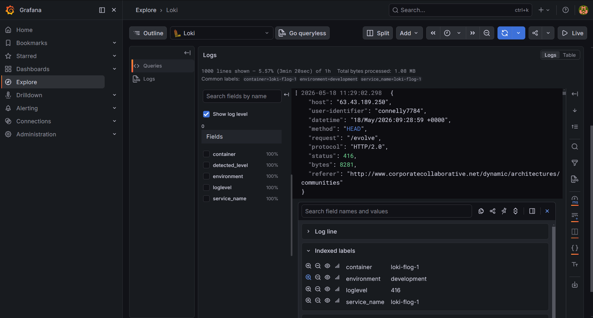
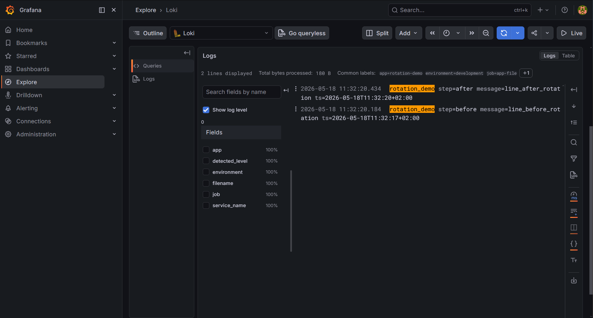
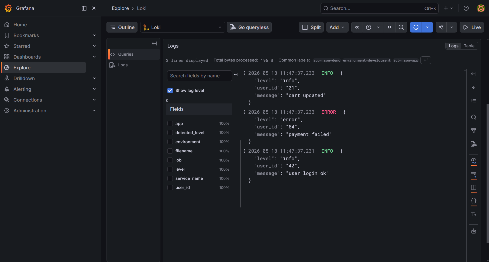
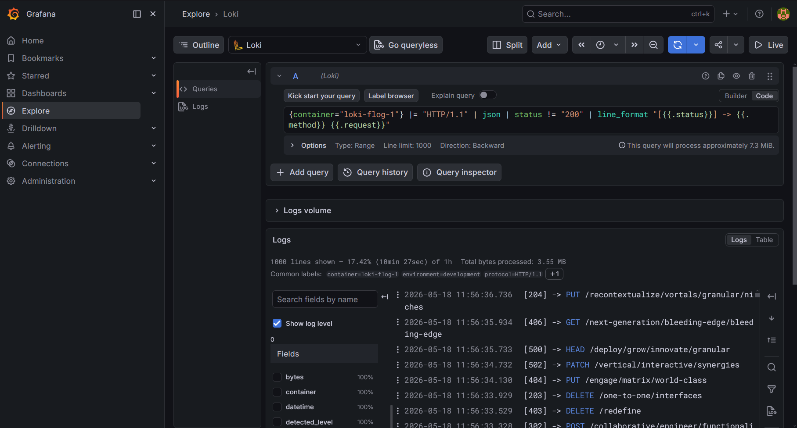
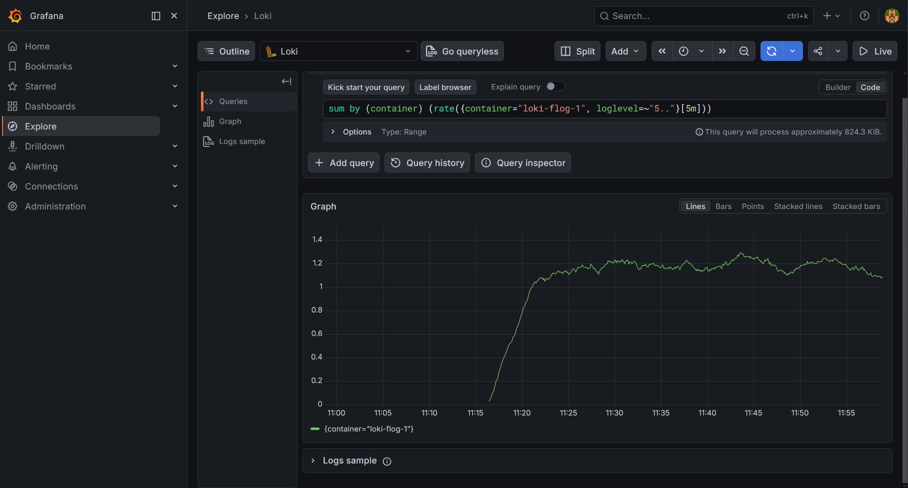
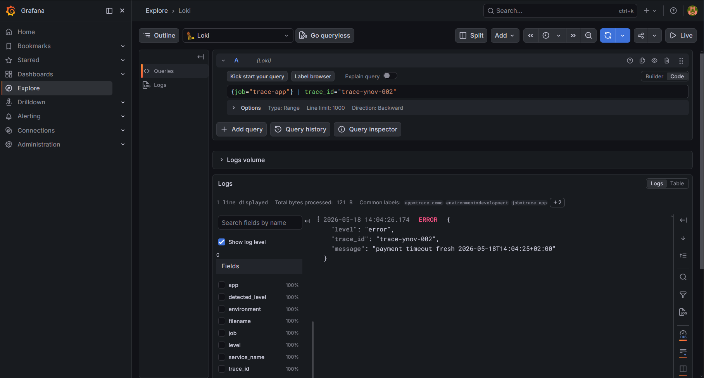
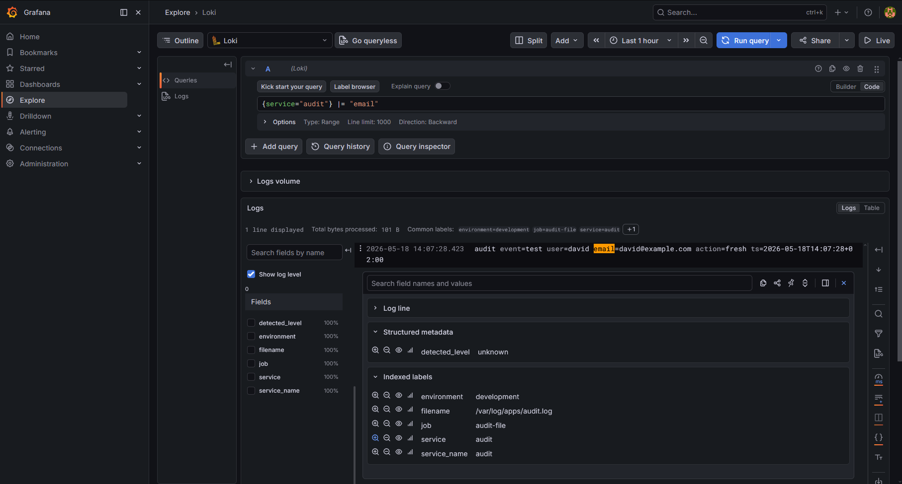
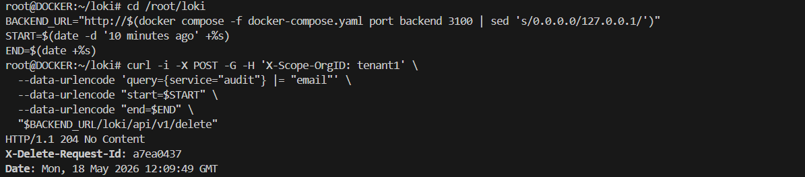

# TP Docker - Grafana Loki & Grafana Alloy

Ce README sert de carnet de bord pendant les exercices du TP Docker sur Grafana Loki, Grafana Alloy et Grafana.

Pour l'énoncé complet, voir [grafana_loki_docker.md](./grafana_loki_docker.md).

## Module 1 - Les Fondamentaux

### Exercice 1 : Déploiement mono-nœud et vérification du flux de logs

**Statut :** Fait

**Image :**



**Objectif / résumé :**

Déployer un environnement Grafana, Loki et Grafana Alloy avec Docker Compose.

<details>
<summary>Commandes utilisées</summary>

```bash
mkdir loki
cd loki
```

```bash
wget https://raw.githubusercontent.com/grafana/loki/v3.7.0/examples/getting-started/docker-compose.yaml -O docker-compose.yaml
wget https://raw.githubusercontent.com/grafana/loki/v3.7.0/examples/getting-started/alloy-local-config.yaml -O alloy-local-config.yaml
wget https://raw.githubusercontent.com/grafana/loki/v3.7.0/examples/getting-started/loki-config.yaml -O loki-config.yaml
```

```bash
docker compose -f docker-compose.yaml up -d
```

```bash
docker compose -f docker-compose.yaml ps
```

```bash
curl http://localhost:3100/
```

```bash
curl http://localhost:3101/ready
```

```bash
curl http://localhost:3102/ready
```

```bash
docker compose -f docker-compose.yaml logs --tail=50 alloy
```

```bash
docker compose -f docker-compose.yaml logs --tail=50 gateway
```

</details>

**Fichiers modifiés / créés :**

- alloy-local-config.yaml
- docker-compose.yaml
- loki-config.yaml

**Observations / résultats :**

La stack démarre avec le `docker-compose.yaml` officiel. Grafana est accessible sur le port `3000` et Loki répond derrière la gateway.

**Problèmes rencontrés / corrections :**

Rien à signaler.

### Exercice 2 : Comprendre les labels et le mécanisme de Relabeling

**Statut :** Fait

**Image :**



**Objectif / résumé :**

Modifier la configuration Alloy pour manipuler les labels envoyés à Loki : ajout d'un label statique, extraction d'un label depuis les logs et suppression d'un label avant ingestion.

<details>
<summary>Commandes utilisées</summary>

```bash
nano alloy-local-config.yaml
```

```bash
grep -n "forward_to\\|loglevel\\|environment\\|container_id" alloy-local-config.yaml
```

```bash
docker compose -f docker-compose.yaml up -d --force-recreate alloy
```

```bash
docker compose -f docker-compose.yaml up -d --force-recreate flog
```

```bash
docker compose -f docker-compose.yaml logs --tail=80 alloy
```

</details>

<details>
<summary>Modifications dans `alloy-local-config.yaml`</summary>

Ajouter dans `discovery.relabel "flog_scrape"` :

```hcl
rule {
        target_label = "environment"
        replacement  = "development"
}
```

Ajouter dans `discovery.relabel "flog_scrape"` :

```hcl
rule {
        source_labels = ["__meta_docker_container_id"]
        target_label  = "container_id"
}
```

Remplacer dans `loki.source.docker "flog_scrape"` :

```hcl
forward_to       = [loki.write.default.receiver]
```

par :

```hcl
forward_to       = [loki.process.flog_scrape.receiver]
```

Ajouter avant `loki.write "default"` :

```hcl
loki.process "flog_scrape" {
        forward_to = [loki.write.default.receiver]

        stage.json {
                expressions = { loglevel = "status" }
        }

        stage.labels {
                values = { loglevel = "" }
        }

        stage.label_drop {
                values = ["container_id"]
        }
}
```

</details>

**Fichiers modifiés / créés :**

- `alloy-local-config.yaml`

**Observations / résultats :**

Alloy redémarre après modification. Dans Grafana Explore, la requête `{environment="development", loglevel=~".+"}` affiche les logs `flog` avec les nouveaux labels.

La requête `{container_id=~".+"}` ne retourne rien, le label a donc bien été supprimé.

**Problèmes rencontrés / corrections :**

Alloy ne démarrait plus à cause d'une erreur de syntaxe dans les maps de `stage.json` et `stage.labels`.

Correction appliquée :

```hcl
expressions = { loglevel = "status" }
values = { loglevel = "" }
```

Après correction, Alloy démarre sans erreur.

### Exercice 3 : Rotation des logs et découverte dynamique

**Statut :** Fait

**Image :**



**Objectif / résumé :**

Configurer Alloy pour suivre un fichier applicatif local, puis vérifier que la collecte continue après une rotation du fichier.

<details>
<summary>Commandes utilisées</summary>

```bash
mkdir -p app-logs
```

```bash
sed -i '/\.\/alloy-local-config.yaml:\/etc\/alloy\/config.alloy:ro/a\      - ./app-logs:/var/log/apps' docker-compose.yaml
```

```bash
nano alloy-local-config.yaml
```

```bash
docker compose -f docker-compose.yaml up -d --force-recreate alloy
```

```bash
echo "rotation_demo step=before message=line_before_rotation ts=$(date -Iseconds)" >> app-logs/app.log
```

```bash
mv app-logs/app.log app-logs/app.log.1
```

```bash
touch app-logs/app.log
```

```bash
echo "rotation_demo step=after message=line_after_rotation ts=$(date -Iseconds)" >> app-logs/app.log
```

```bash
docker compose -f docker-compose.yaml logs --tail=80 alloy
```

```bash
curl -sG -H 'X-Scope-OrgID: tenant1' --data-urlencode 'query={job="app-file"}' --data-urlencode 'limit=10' http://localhost:3100/loki/api/v1/query_range
```

</details>

**Modifications dans `docker-compose.yaml` :**

Ajout du dossier local de logs dans le conteneur Alloy :

```yaml
- ./app-logs:/var/log/apps
```

<details>
<summary>Modifications dans `alloy-local-config.yaml`</summary>

Ajout d'une source fichier :

```hcl
loki.source.file "app_logs" {
        targets = [
                {__path__ = "/var/log/apps/*.log", job = "app-file", app = "rotation-demo", environment = "development"},
        ]
        forward_to = [loki.write.default.receiver]

        file_match {
                enabled     = true
                sync_period = "5s"
        }
}
```

</details>

**Fichiers modifiés / créés :**

- `docker-compose.yaml`
- `alloy-local-config.yaml`
- `app-logs/app.log`
- `app-logs/app.log.1`

**Observations / résultats :**

Alloy détecte bien le fichier `/var/log/apps/app.log` et commence à le suivre.

Après rotation du fichier, je retrouve les deux lignes de test dans Loki : `line_before_rotation` et `line_after_rotation`.

**Problèmes rencontrés / corrections :**

Le dossier `app-logs` devait être monté dans le conteneur Alloy, sinon Alloy ne pouvait pas voir les fichiers locaux.

### Exercice 4 : Pipelines Alloy et Parsing à la source

**Statut :** Fait

**Image :**



**Objectif / résumé :**

Ajouter un pipeline Alloy pour parser des logs JSON, extraire quelques champs en labels et filtrer les lignes `debug`.

<details>
<summary>Commandes utilisées</summary>

```bash
cat > app-logs/json-app.json <<'EOF'
{"level":"info","user_id":"42","message":"user login ok"}
{"level":"debug","user_id":"42","message":"debug detail not for loki"}
{"level":"error","user_id":"84","message":"payment failed"}
{"level":"debug","user_id":"84","message":"temporary debug noise"}
{"level":"info","user_id":"21","message":"cart updated"}
EOF
```

```bash
nano alloy-local-config.yaml
```

```bash
docker compose -f docker-compose.yaml up -d --force-recreate alloy
```

```bash
docker compose -f docker-compose.yaml logs --tail=80 alloy
```

```bash
curl -sG -H 'X-Scope-OrgID: tenant1' --data-urlencode 'query={job="json-app"}' --data-urlencode 'limit=10' http://localhost:3100/loki/api/v1/query_range
```

```bash
curl -sG -H 'X-Scope-OrgID: tenant1' --data-urlencode 'query={job="json-app"} |= "debug"' --data-urlencode 'limit=10' http://localhost:3100/loki/api/v1/query_range
```

</details>

<details>

<summary>Modifications dans `alloy-local-config.yaml`</summary>

Ajout d'une source fichier dédiée aux logs JSON :

```hcl
loki.source.file "json_app" {
        targets = [
                {__path__ = "/var/log/apps/json-app.json", job = "json-app", app = "json-demo", environment = "development"},
        ]
        forward_to = [loki.process.json_app.receiver]
}
```

Ajout du pipeline de parsing :

```hcl
loki.process "json_app" {
        forward_to = [loki.write.default.receiver]

        stage.json {
                expressions = { level = "level", user_id = "user_id", message = "message" }
        }

        stage.drop {
                source = "level"
                value  = "debug"
        }

        stage.labels {
                values = { level = "", user_id = "" }
        }
}
```

</details>

**Fichiers modifiés / créés :**

- `alloy-local-config.yaml`
- `app-logs/json-app.json`

**Observations / résultats :**

Les logs JSON sont bien parsés par Alloy. Dans Loki, les lignes `info` et `error` remontent avec les labels `level` et `user_id`.

Les lignes `debug` ne remontent pas dans Grafana, elles sont filtrées avant l'envoi.

**Problèmes rencontrés / corrections :**

Rien de bloquant sur cet exercice. J'ai utilisé un fichier séparé `json-app.json` pour éviter de mélanger ce test avec les logs de rotation de l'exercice précédent.

## Module 2 - Maîtrise de LogQL

### Exercice 5 : Filtrage avancé et requêtes de formatage

**Statut :** Fait

**Image :**



**Objectif / résumé :**

Tester les filtres LogQL sur les logs `flog`, parser le JSON, puis reformater l'affichage avec `line_format`.

<details>
<summary>Commandes utilisées</summary>

```bash
docker compose -f docker-compose.yaml ps
```

```bash
curl -sG -H 'X-Scope-OrgID: tenant1' --data-urlencode 'query={container="loki-flog-1"} |= "HTTP/1.1" | json | status != "200" | line_format "[{{.status}}] -> {{.method}} {{.request}}"' --data-urlencode 'limit=10' http://localhost:3100/loki/api/v1/query_range
```

</details>

**Requêtes testées :**

```logql
{container="loki-flog-1"} |= "HTTP/1.1" | json | status != "200" | line_format "[{{.status}}] -> {{.method}} {{.request}}"
```

**Observations / résultats :**

La requête retourne uniquement des logs HTTP/1.1 en excluant les réponses `200`.

L'affichage est plus lisible avec `line_format`, par exemple `[404] -> PUT /methodologies`.

**Problèmes rencontrés / corrections :**

Rien de bloquant. Le filtre est plus lisible en parsant d'abord le JSON, puis en excluant `status="200"`.

### Exercice 6 : Métriques LogQL et expressions d'alerte

**Statut :** Fait

**Image :**



**Objectif / résumé :**

Transformer les logs d'erreur en métrique avec LogQL, puis préparer une expression d'alerte simple.

<details>
<summary>Commandes utilisées</summary>

```bash
curl -sG -H 'X-Scope-OrgID: tenant1' --data-urlencode 'query=sum by (container) (rate({container="loki-flog-1", loglevel=~"5.."}[5m]))' http://localhost:3100/loki/api/v1/query
```

```bash
curl -sG -H 'X-Scope-OrgID: tenant1' --data-urlencode 'query=sum by (container) (rate({container="loki-flog-1", loglevel=~"5.."}[5m])) > 5' http://localhost:3100/loki/api/v1/query
```

</details>

**Requêtes testées :**

```logql
sum by (container) (rate({container="loki-flog-1", loglevel=~"5.."}[5m]))
```

**Expression d'alerte :**

```logql
sum by (container) (rate({container="loki-flog-1", loglevel=~"5.."}[5m])) > 5
```

**Observations / résultats :**

La requête retourne un taux d'erreurs par seconde sur les 5 dernières minutes, groupé par conteneur.

Dans mon test, le taux était inférieur au seuil de `5 erreurs/sec`, donc l'expression d'alerte ne se déclenche pas.

**Problèmes rencontrés / corrections :**

Pas de problème particulier. Le label `loglevel` créé à l'exercice 2 rend le filtre sur les statuts HTTP `5xx` assez simple.

## Module 3 - Architectures Avancées

### Exercice 7 : Métadonnées structurées (Structured Metadata)

**Statut :** Fait

**Image :**



**Objectif / résumé :**

Tester l'utilisation d'un `trace_id` sans l'ajouter comme label classique dans Loki.

<details>
<summary>Commandes utilisées</summary>

```bash
nano alloy-local-config.yaml
```

```bash
cat > app-logs/trace-app.json <<'EOF'
{"level":"info","trace_id":"trace-ynov-001","message":"checkout started"}
{"level":"error","trace_id":"trace-ynov-002","message":"payment timeout"}
EOF
```

```bash
docker compose -f docker-compose.yaml up -d --force-recreate alloy
```

```bash
docker compose -f docker-compose.yaml logs --tail=80 alloy
```

```bash
curl -s -H 'X-Scope-OrgID: tenant1' http://localhost:3100/loki/api/v1/label/trace_id/values
```

```bash
curl -sG -H 'X-Scope-OrgID: tenant1' --data-urlencode 'query={job="trace-app"} | trace_id="trace-ynov-002"' --data-urlencode 'limit=10' http://localhost:3100/loki/api/v1/query_range
```

</details>

<details>
<summary>Configuration réalisée:</summary>

Dans Alloy, le champ `trace_id` est extrait depuis un log JSON puis envoyé comme structured metadata :

```hcl
stage.json {
        expressions = { level = "level", trace_id = "trace_id", message = "message" }
}

stage.labels {
        values = { level = "" }
}

stage.structured_metadata {
        values = { trace_id = "" }
}
```

J'ai aussi ajouté une petite source fichier pour générer quelques lignes de test :

```hcl
loki.source.file "trace_app" {
        targets = [
                {__path__ = "/var/log/apps/trace-app.json", job = "trace-app", app = "trace-demo", environment = "development"},
        ]
        forward_to = [loki.process.trace_app.receiver]
}
```

</details>

**Fichiers modifiés / créés :**

- `alloy-local-config.yaml`
- `app-logs/trace-app.json`

**Requêtes testées :**

```logql
{job="trace-app"} | trace_id="trace-ynov-002"
```

**Observations / résultats :**

La requête retrouve bien la ligne liée au `trace_id` demandé :

```logql
{job="trace-app"} | trace_id="trace-ynov-002"
```

Le champ `trace_id` reste attaché à la ligne, mais il n'est pas utilisé comme label principal pour l'indexation.

**Problèmes rencontrés / corrections :**

Rien de bloquant sur cette partie. J'ai gardé un exemple volontairement simple pour vérifier le principe.

### Exercice 8 : Rétention granulaire, purge et sharding

**Statut :** Fait

**Image :**





**Objectif / résumé :**

Configurer la rétention Loki et tester l'envoi d'une demande de purge ciblée.

<details>
<summary>Commandes utilisées</summary>

```bash
nano loki-config.yaml
```

```bash
docker compose -f docker-compose.yaml up -d --force-recreate read write backend gateway
```

```bash
BACKEND_URL="http://$(docker compose -f docker-compose.yaml port backend 3100 | sed 's/0.0.0.0/127.0.0.1/')"
```

```bash
START=$(date -d '10 minutes ago' +%s)
END=$(date +%s)
```

```bash
curl -i -X POST -G -H 'X-Scope-OrgID: tenant1' --data-urlencode 'query={service="audit"} |= "email"' --data-urlencode "start=$START" --data-urlencode "end=$END" "$BACKEND_URL/loki/api/v1/delete"
```

```bash
curl -s -H 'X-Scope-OrgID: tenant1' "$BACKEND_URL/loki/api/v1/delete"
```

</details>

**Fichiers modifiés / créés :**

- `loki-config.yaml`

<details>
<summary>Configuration réalisée :</summary>

Dans `loki-config.yaml`, activation de la rétention et de l'API de suppression :

```yaml
compactor:
  working_directory: /tmp/compactor
  retention_enabled: true
  delete_request_store: s3

limits_config:
  allow_structured_metadata: true
  deletion_mode: filter-and-delete
  retention_period: 168h
  retention_stream:
    - selector: '{service="audit"}'
      priority: 1
      period: 720h
```

</details>

**Observations / résultats :**

La configuration de rétention est acceptée au redémarrage de Loki.

La demande de purge sur `{service="audit"} |= "email"` est acceptée par l'API avec un retour `204 No Content`, puis elle apparaît dans la liste des demandes avec le statut `received`.

**Problèmes rencontrés / corrections :**

La suppression n'est pas immédiate : Loki enregistre la demande, puis le compactor la traite ensuite. J'ai donc gardé comme preuve le retour API et la présence de la demande dans la liste.

## Module 4 - Deep Dive & Multi-Tenancy

### Exercice 9 : Isolation multi-tenant avec injection d'en-têtes HTTP

**Statut :** Non réalisé

**Image :**

Aucune image.

**Objectif / résumé :**

Non réalisé dans le cadre de ce rendu.

<details>
<summary>Commandes utilisées</summary>

```bash
Non réalisé
```

</details>

**Fichiers modifiés / créés :**

- Aucun

**Configuration réalisée :**

Non réalisé.

**Observations / résultats :**

Non réalisé.

**Problèmes rencontrés / corrections :**

Rien à signaler.

### Exercice 10 : Architecture microservices et routage par passerelle (Gateway)

**Statut :** Non réalisé

**Image :**

Aucune image.

**Objectif / résumé :**

Non réalisé dans le cadre de ce rendu.

<details>
<summary>Commandes utilisées</summary>

```bash
Non réalisé
```

</details>

**Fichiers modifiés / créés :**

- Aucun

**Configuration réalisée :**

Non réalisé.

**Tests réalisés :**

```bash
Non réalisé
```

**Observations / résultats :**

Non réalisé.

**Problèmes rencontrés / corrections :**

Rien à signaler.

## Note d'utilisation de l'IA

ChatGPT, plus particulièrement le modèle ChatGPT 5.5 Codex, a été utilisé pour convertir le fichier original `grafana_loki_docker.docx` en Markdown (`grafana_loki_docker.md`) et pour réaliser le scaffolding initial du fichier `README.md`.

Il a également servi d'assistance pour certaines vérifications techniques, ainsi que pour relire et corriger l'orthographe, la grammaire et la cohérence globale du document.

Le contenu du README a ensuite été complété et validé par moi-même, M. Tristan Truckle.
